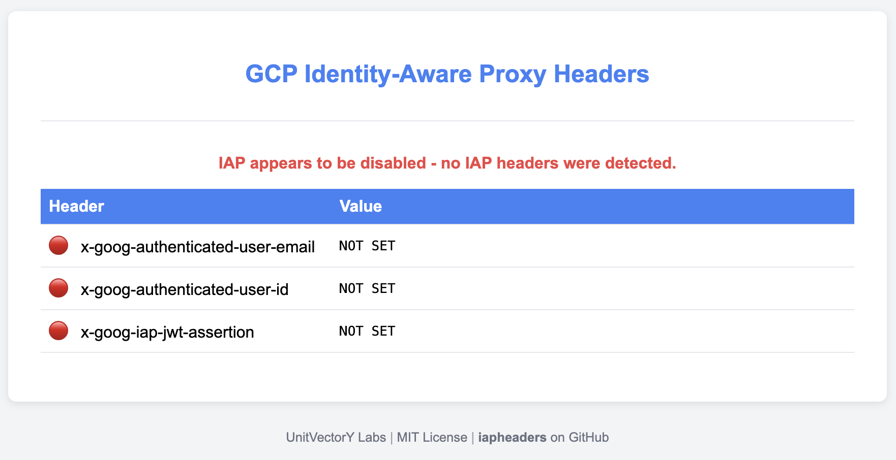

# iapheaders

Displays GCP Identity-Aware Proxy headers and JWT for inspection.

## Overview

`iapheaders` is a web application that allows you to inspect request headers for testing and understanding GCP's [Identity-Aware Proxy](https://cloud.google.com/security/products/iap) (IAP).

### Example for Valid IAP Headers

### Example for Missing IAP Headers

## Usage

The latest `iapheaders` Docker image is available for deployment from GitHub Packages at [ghcr.io/unitvectory-labs/iapheaders](https://github.com/UnitVectorY-Labs/iapheaders/pkgs/container/iapheaders).

## Configuration

The application is configurable through environment variables. Below are the available configurations:

- `HIDE_SIGNATURE`: The signature of the JWT from IAP is removed and not displayed, the signature component of the JWT is replaced with "SIGNATURE_REMOVED_BY_IAPHEADERS" (default: false).
- `PORT`: The port on which the server listens (default: 8080).

## IAP Headers

IAP sets the following headers:

- `x-goog-authenticated-user-email`: Authenticated user's email address.
- `x-goog-authenticated-user-id`: Unique identifier of the authenticated user.
- `x-goog-iap-jwt-assertion`: JWT token for user identity verification.

`iapheaders` displays these headers and decodes the JWT token to show its contents. The JWT, signed by Google, can be verified using the public key from [https://www.gstatic.com/iap/verify/public_key-jwk](https://www.gstatic.com/iap/verify/public_key-jwk). `iapheaders` checks the signature and indicates the JWT's validity.
